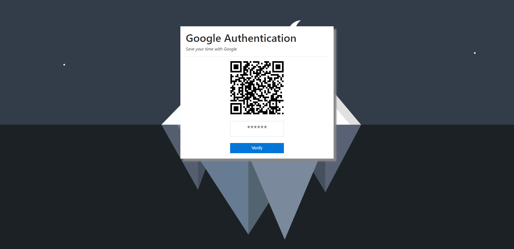
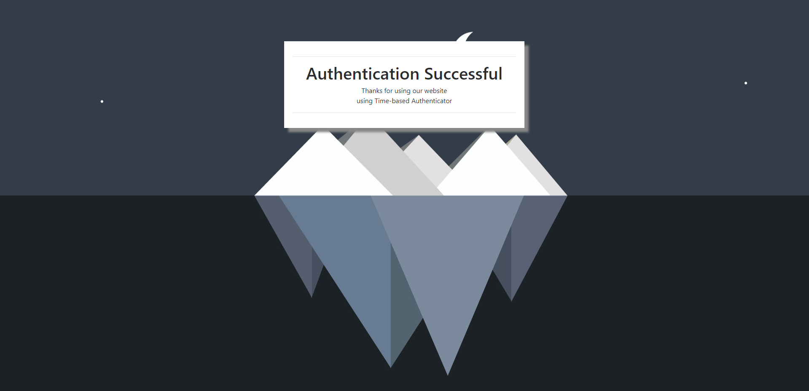

# googleAuth
 A simple authentication system. (2019 - mini project) 
This can be used for google mobile based authentication systems. You can integrate this with your project for user authentication.

## Project description
Name: googleAuth  
Fronted Language: HTML, CSS 
Backend : PHP  
Platform: WEB  
Project No: 13  
Year: 2019

## Demo Video
<!--  -->

## Screen shot
### Home
 

### Authentication success
 

## Authors

* **AbirHasan**

Check out my other works [@XAbirHasan](https://github.com/XAbirHasan)
